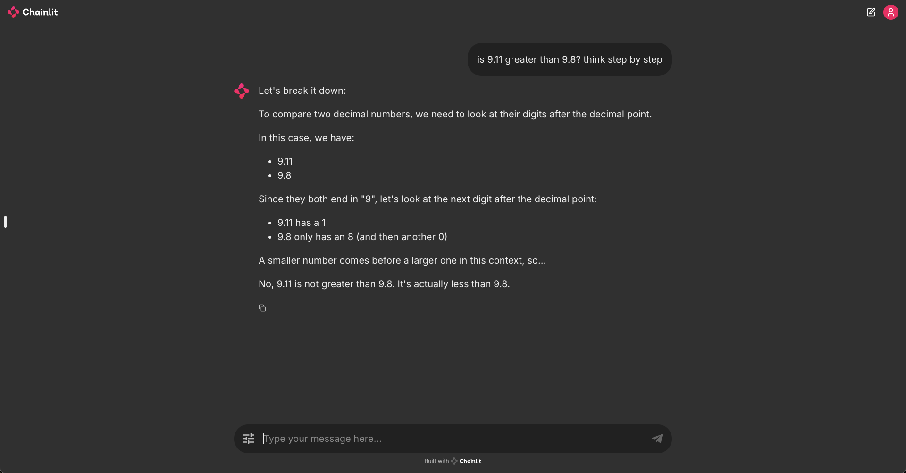

# **Chainlit Langgraph Integration**  
An integration of Chainlit with Langgraph, leveraging **Llama 3.2** via **Ollama** for advanced language processing and interaction.



## **Overview**
This repository provides a demo showcasing the integration between Chainlit and Langgraph, designed to facilitate seamless communication between systems using state-of-the-art **Llama 3.2** by Ollama. Whether you're working with conversational AI or need a robust language model for text-based tasks, this project helps streamline the process.

## **Features**
- **Chainlit**: A powerful tool for creating interactive interfaces for AI models.
- **Langgraph**: Enables structured data integration and interaction.
- **Llama 3.2** via **Ollama**: Ensures high-performance language modeling for your project.
- Easy-to-follow setup with **Poetry** for dependency management.
  
## **Installation Guide**
Follow these steps to set up and run the project in your Python 3.10 virtual environment.

### **Step 1: Python Requirements**
Make sure you have Python 3.10 installed. Then, install the necessary dependencies by running the following commands:

```bash
pip install --upgrade pip
pip install poetry
poetry install
```

### **Step 2: Setting Up Ollama**
This demo uses **Llama 3.2** via **Ollama** by default. To configure Ollama:

1. Download and install [Ollama](https://ollama.com/download).
2. Pull the required Llama model:

```bash
ollama pull llama3.2
```

3. Start the Ollama server:

```bash
ollama serve
```

### **Step 3: Running the Demo**
After completing the above steps, run the Chainlit demo using the following command:

```bash
chainlit run app.py --port 8000
```

This will start the demo on **port 8000**, providing a user interface to interact with the Langgraph integration powered by **Llama 3.2**.

## **Usage Examples**
- **Conversational AI**: Utilize Chainlit to create conversational interfaces that can be integrated into websites or apps.
- **Text Processing**: Leverage Llama's advanced natural language understanding for tasks like summarization, translation, or Q&A.

## **Additional Resources**
- [Chainlit Documentation](https://docs.chainlit.io/get-started/overview)
- [Langgraph Documentation](https://langchain-ai.github.io/langgraph/)
- [Ollama Llama 3.2 Model Info](https://ollama.com/library/llama3.2)
