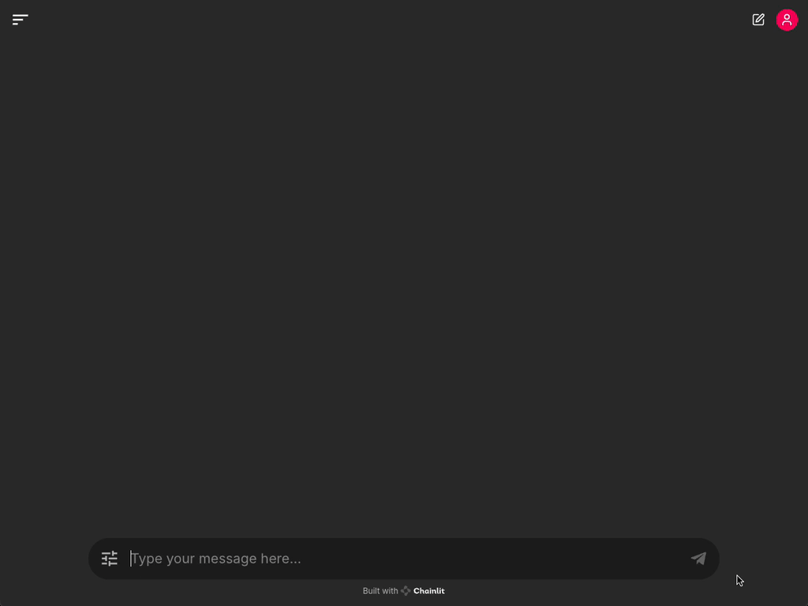

# **Chainlit Langgraph Integration**  
Build your AI agent chatbot applications with this powerful integration of **Chainlit** and **LangGraph**.



## **Overview**
This repository provides a demo showcasing the integration between Chainlit and Langgraph, designed to facilitate seamless communication between systems using state-of-the-art language models. Whether you're working with conversational AI or need a robust language model for text-based tasks, this project helps streamline the process with support for multiple LLMs.

## **Features**
- **Chainlit**: A powerful tool for creating interactive interfaces for AI models.
- **LangGraph**: Enables the creation of complex language agentic workflows.
- **Multiple LLM Support**: Automaatically detects and uses the following LLMs:
  - **Ollama**: Open source model.
  - **Claude**: Advanced AI models by Anthropic.
  - **GPT**: Advanced AI models by OpenAI.
- **Multi-Step Examples**: Explore a variety of use cases with multi-step examples.
- **Search Engine**: Search for information from the web.
- Easy-to-follow setup with **Poetry** for dependency management.

## Upcoming Features
- **Image Input**: User can upload images and interact with them.
- **Image Generation**: Generate images based on user input.
- **OpenAI o1-like agentic workflow**: Advanced self-prompting agentic workflow.

## **Installation Guide**
Follow these steps to set up and run the project using Docker Compose or in your Python 3.10 virtual environment.

1. Make sure you have Docker and Docker Compose installed on your system.
2. Clone this repository and navigate to the project directory.
3. Copy the `.env.example` file to `.env` and update the necessary environment variables:

```bash
cp .env.example .env
```

4. Edit the .env file and set the required variables, including:

  - API keys (OPENAI_API_KEY, ANTHROPIC_API_KEY, TAVILY_API_KEY)
  - DB volume settings (POSTGRES_VOLUME_PATH, MINIO_VOLUME_PATH)
  - (Optional) Google OAuth
  - (Optional) LangSmith

5. Start the services using Docker Compose

```bash
docker compose up
```

This will start all the necessary services, including the Chainlit application, PostgreSQL database, and MinIO object storage.


### Setting up Ollama (Optional)

1. Download and install [Ollama](https://ollama.com).
2. Pull whatever model you want to use, for example: 

```bash
ollama pull cas/ministral-8b-instruct-2410_q4km:latest
ollama pull llama3.2:3b-instruct-q8_0
```

of any gguf-based model on the [HuggingFace](https://huggingface.co/docs/hub/ollama).

```bash
ollama run hf.co/{username}/{repository}:{quantization}
```


## **Creating Your Own Workflow**
- Inherit from the `BaseWorkflow` and `BaseState` classes. For more details, refer to the [Simple Chat Workflow](./chat_workflow/workflows/simple_chat.py) example.
- Place your workflow in the `chat_workflow/workflows` module.

## **Usage Examples**
- **Conversational AI**: Utilize Chainlit to create conversational interfaces that can be integrated into websites or apps.
- **Text Processing**: Leverage advanced natural language understanding for tasks like summarization, translation, or Q&A.

## **Additional Resources**
- [Chainlit Documentation](https://docs.chainlit.io/get-started/overview)
- [Langgraph Documentation](https://langchain-ai.github.io/langgraph/)
